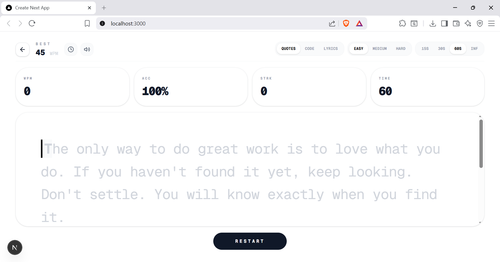

````md
# Frontend Mentor - Typing Speed Test solution

This is a solution to the [Typing Speed Test challenge on Frontend Mentor](https://www.frontendmentor.io/challenges/typing-speed-test). Frontend Mentor challenges help you improve your coding skills by building realistic projects.

## Table of contents

- [Overview](#overview)
  - [The challenge](#the-challenge)
  - [Screenshot](#screenshot)
  - [Links](#links)
- [My process](#my-process)
  - [Built with](#built-with)
  - [What I learned](#what-i-learned)
  - [Continued development](#continued-development)
  - [Useful resources](#useful-resources)
- [Author](#author)
- [Acknowledgments](#acknowledgments)

## Overview

### The challenge

Users should be able to:

- View the optimal layout for the interface depending on their device's screen size
- See hover and focus states for all interactive elements on the page

### Screenshot

<p align="center">
  
  <br>
  <em>Desktop Landing Page</em>
</p>

<p align="center">
  
  <br>
  <em>Typing Interface</em>
</p>

### Links

- Solution URL: https://github.com/Emafido/typing-speed  
- Live Site URL: https://tspeed-fm30.vercel.app/

## My process

### Built with

- Semantic HTML5 markup
- Flexbox and CSS Grid
- Mobile-first workflow
- [React](https://react.dev/) - JS library
- [Next.js](https://nextjs.org/) - React framework
- [TypeScript](https://www.typescriptlang.org/) - For static typing
- [Tailwind CSS](https://tailwindcss.com/) - For styling
- [Canvas Confetti](https://www.npmjs.com/package/canvas-confetti) - For visual effects

### What I learned

Building **VELO** challenged me to think critically about DOM manipulation within a React functional component. The most significant hurdle was ensuring the **active character** remained visible on mobile devices.

When a user taps the input on mobile, the virtual keyboard slides up, effectively cutting the viewport height in half. This often hid the text the user was trying to type. To solve this, I implemented a custom auto-scroll logic using `useRef` to track the active character's position relative to its container.

Here is the logic I developed to keep the cursor centered in the "safe zone" of the screen:

```tsx
// Auto-scroll logic to keep active character in view
useEffect(() => {
  if (activeCharRef.current && textContainerRef.current) {
    const container = textContainerRef.current;
    const element = activeCharRef.current;

    // Calculate position relative to container
    const elementTop = element.offsetTop;
    const containerHeight = container.clientHeight;
    const scrollTop = container.scrollTop;

    // Only scroll if the cursor moves outside the middle 50% of the screen
    if (
      elementTop < scrollTop + containerHeight * 0.2 ||
      elementTop > scrollTop + containerHeight * 0.7
    ) {
      container.scrollTo({
        // Center the active element
        top: elementTop - containerHeight / 2 + element.offsetHeight / 2,
        behavior: "smooth",
      });
    }
  }
}, [userInput]);
````

I also learned how to handle `Audio` objects in React efficiently. Initially, creating new `Audio()` instances on every keystroke caused lag and memory issues. I refactored this to use `useRef`, initializing the audio files once when the component mounts to ensure low-latency feedback without performance costs.

```tsx
// Efficient Audio Handling with useRef
const successAudio = useRef<HTMLAudioElement | null>(null);

useEffect(() => {
  // Load once on mount
  successAudio.current = new Audio("/success.mp3");
  successAudio.current.volume = 0.2;
}, []);

const playSound = () => {
  if (successAudio.current) {
    successAudio.current.currentTime = 0; // Reset to start for rapid firing
    successAudio.current.play();
  }
};
```

### Continued development

In future iterations of **VELO** and upcoming projects, I aim to focus on:

1. **Full-Stack Integration:** Currently, VELO relies on `localStorage` for data persistence. My next step is to integrate a backend service (like **Supabase** or **PostgreSQL**) to allow users to create accounts, save their history permanently across devices, and view global leaderboards.

2. **Real-Time Communication (WebSockets):** I want to implement a multiplayer "Race Mode" where users can compete against each other in real time. This will involve learning **Socket.io** to handle live data streams between clients.

3. **Advanced Accessibility (a11y):** While the app is keyboard navigable, I want to refine the experience for screen reader users, specifically ensuring that dynamic updates of the active character and live statistics are announced correctly without overwhelming the user (using `aria-live` regions more effectively).

4. **Testing methodologies:** I plan to incorporate Unit Testing (with **Jest**) and End-to-End testing (with **Playwright**) to ensure the reliability of the typing engine logic as the application grows in complexity.

### Useful resources

* [React Refs Documentation](https://react.dev/learn/referencing-values-with-refs) – Essential for understanding DOM manipulation for the auto-scroll feature.
* [Canvas Confetti Docs](https://github.com/catdad/canvas-confetti) – Helped implement the high-score celebration effect efficiently without heavy libraries.

## Author

* Website – [Emafido Emmanuel Aridon](https://emafido-emmanuel.vercel.app/)
* Frontend Mentor – [@Emafido](https://www.frontendmentor.io/profile/Emafido)
* Twitter – [@EmmanuelEmafido](https://x.com/EmmanuelEmafido)

## Acknowledgments

* **Frontend Mentor:** For providing the challenge specifications and design assets that served as the foundation for this project.
* **Kiril Vatev (Catdad):** For creating the [canvas-confetti](https://github.com/catdad/canvas-confetti) library.
* **The React Team:** For the excellent documentation on `useRef` and DOM manipulation, which was crucial for solving the mobile auto-scroll challenge.

```
```
